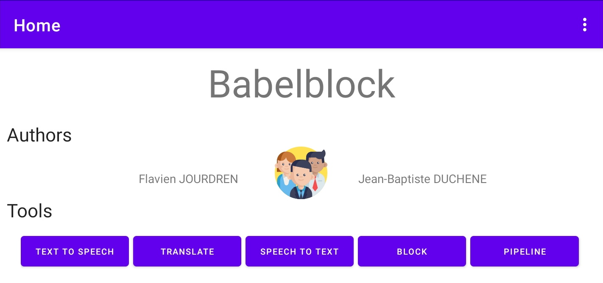
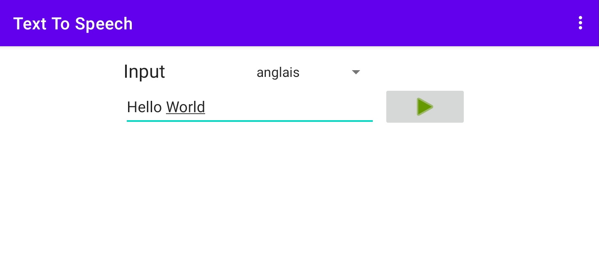
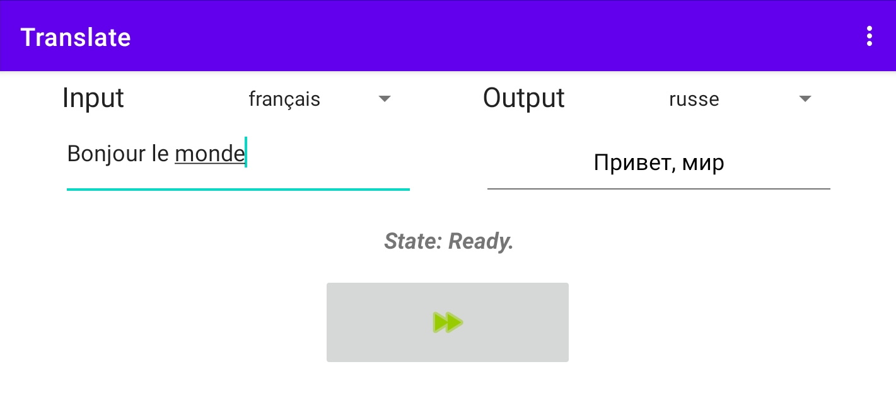
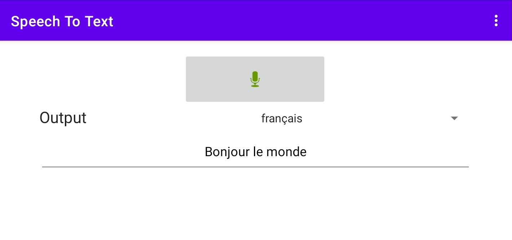
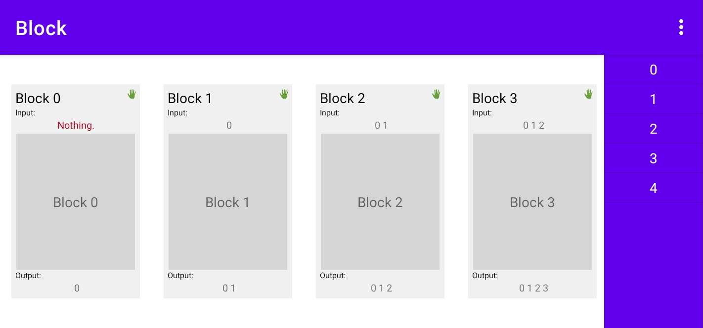
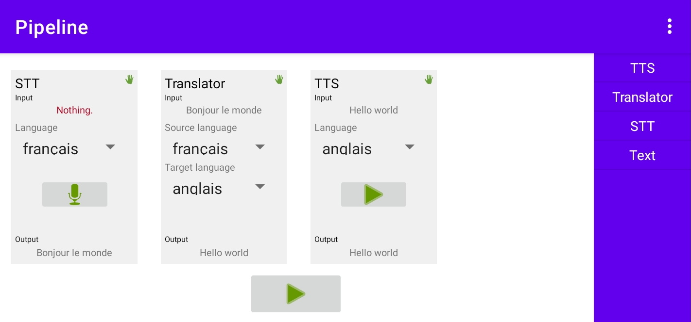

# BabelBlock - Projet Android ENSSAT
BabelBlock est le nom de notre projet réalisé en IMR3 dans le cadre du module d'Android.

BabelBlock permet d'utiliser les fonctionnalités de Text To Speech / Speech To Text / Traduction de manière indépendante ou sous la forme d'un pipeline personnalisable.

## Développeurs
Le projet a été développé par :

* [Flavien JOURDREN](https://github.com/fjourdren)
* [Jean-Baptiste DUCHÊNE](https://github.com/jbduchenee)

## Installation
Cloner le répertoire git et importer dans Android Studio
```
git clone https://github.com/fjourdren/private_android
```

Puis construire le projet sur l'appareil cible. Il est nécéssaire de disposer des services Google pour la synthèse vocale.

En cas de problème pour build le projet il peut être nécéssaire de resynchroniser les fichiers gradle du projet. Pour cela :

1. Dans le dossier racine du projet, ouvrir `settings.gradle`
2. Couper la ligne `include ':app'` du fichier
3. Cliquer sur le menu `File` et sélectionner `Sync Project with Gradle files.`
4. Après la synchronisation, coller à nouveau la ligne `include ':app'` et relancer une synchronisation

## Fonctionnalités
### Menu principal

### Text To Speech

### Translate

### Speech To Text

### Bloc

### Pipeline

